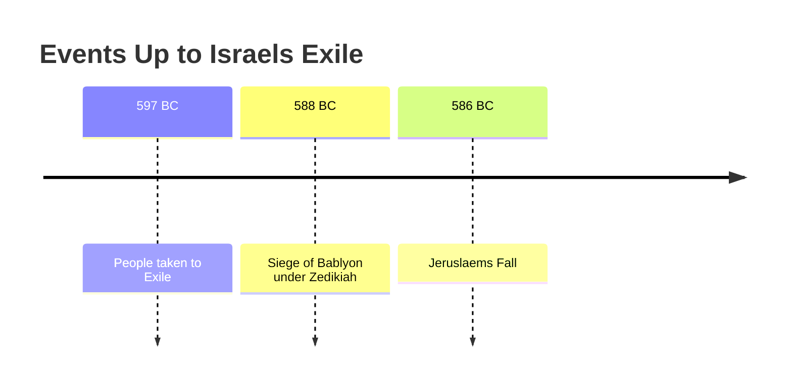

---
tags:
  - c/judgment
  - c/salvation
  - c/sanctification
  - c/backsliding
parent:
  - "[[PUBLIC_VUALT/destruction-&-rebuilding-study-of-jeremiah|destruction-&-rebuilding-study-of-jeremiah]]"
noteType: output
---
[^garner-howes]: [Jeremiah 24 - Garner-Howes Baptist Commentary - Bible Commentaries - StudyLight.org](https://www.studylight.org/commentaries/eng/ghb/jeremiah-24.html)
[^matthew-poole]: [Jeremiah 24 Matthew Poole's Commentary](https://biblehub.com/commentaries/poole/jeremiah/24.htm)
[^ellicott]: [Jeremiah 24 Ellicott's Commentary for English Readers](https://biblehub.com/commentaries/ellicott/jeremiah/24.htm)
[^matthew-henry]: [Jeremiah 24 Commentary - Matthew Henry Commentary on the Whole Bible (Complete)](https://www.biblestudytools.com/commentaries/matthew-henry-complete/jeremiah/24.html)
[^enduring-word]: [Enduring Word Bible Commentary Jeremiah Chapter 24](https://enduringword.com/bible-commentary/jeremiah-24/)
[^john-calvin]: [Jeremiah 24 Calvin's Commentaries](https://biblehub.com/commentaries/calvin/jeremiah/18.htm)
[^john-gill]: [Jeremiah 24 Bible Commentary - John Gill’s Exposition of the Bible \| Christianity.com](https://www.christianity.com/bible/commentary/john-gill/jeremiah/24)
# Last Week
Last week we evaluated a section that I called God's Song of Sorrow. This used the idea of a burden and related wordplay for the original Hebrew word that [God](God.md) used through [Jeremiah](p-jeremiah.md).

This guided our discussion on the way we use words the way that ones word becomes their burden. This ties into our self talk not only of ourselves but of our church. I will say that I have not done well in applying this. Furthermore for us to not consume the mockery (which is a form of persecution) that the world gives.

# This Week
This is one of the shortest chapters of the book but it is still *very* important. We open to [Jehoiachin](%F0%9F%A7%91Jehoiachin.md) and all the skilled laborers were taken by [Nebuchadnezzar](%F0%9F%A7%91Nebuchadnezzar.md) to [Babylon](%F0%9F%8F%99%EF%B8%8FBabylon.md). Note that this probably included characters like [Daniel](%F0%9F%A7%91Daniel.md) as well. But this comes with an object lesson [^1]

## The Object Lesson
This object lesson God uses baskets of good figs and bad figs [^2] which have some relatively obvious symbolism. The Good figs are tied to those that were taken to Babylon and would later return (after having repented and  returned to God) and rebuilt [Jerusalem](city-jerusalem.md). The second group or bad figs were those that remind in Israel under [Zedekiah](%F0%9F%A7%91Zedekiah.md) [^3].

Some history around this. These events occur around 597 BC and this results in Zedekiah becoming the puppet ruler of Jerusalem. Here we see the idea that the ones who were left in the [Southern Kingdom](Southern%20Kingdom.md) thought they were the ones that God had blessed and protected, which clearly God was inverting those expectations [^garner-howes] [^enduring-word].

A few ideas here is that the figs were probably related to the first fruit offerings at the temple as Figs are harvestable rather early [^ellicott] [^matthew-henry] which does some with the assumption that God was using a physical occurrence to teach a spiritual lesson [^5]. 

### Fig Symbology

So with this passage and the Fig Tree Jesus cursed I decided to look deeper into figs and what they tend to represent. They typically are used to highlight the spiritual state of people, this is repeated and used many times as well for the concept of tithing or first fruit.

There are many other places where figs are used as a symbol of Israel [^7] or Fig Trees are used to teach a lesson on people who look good on the outside but truthfuly have no fruit of salvation on the inside [^8]

### Why were the Exiles "Saved"
So a bit more history is needed here. About 11 years after the exile Jerusalem is sieged (I really need to make a timeline lol). Those exiled would not face this siege [^matthew-henry]. Matthew Henry continues in his commentary to highlight a Biblical principal

> Early suffering sometimes proves for the best
\- Matthew Henry

This shows in the few events we have recorded including Daniel's lifetime and the events in [Esther](Esther.md). 

Ultimately the good were saved because they were the ones who were not stubbornly in their sin and would be corrected easily. While the others were not and would have to go through a lot more "tilling" to be corrected. They would face utter destruction in just a few years.

This does include that there are those who tried to "flee" judgment by going to Egypt which God still judged [^john-gill].
## Applications

An interesting interpretation of  this passage from Ellicott is that there is a time difference between God showing Jeremiah the vision and asking the question; and God giving Jeremiah the answer [^ellicott] this probably also applied to Jeremiah's first vision as well [^4]

In this chapter we see God do an unexpended thing in exiling the "good" people. This is due to their relationship to him and had a desired output. The truth here is that God was behind unimpededly gracious to those that looked cursed on the outside, He was correcting and discipling them  [^matthew-poole] [^john-calvin]. This is something we are explicitly told that God does [^6] with the purpose of rebuilding people.

1. Has God ever disciplined you lovingly?
    1. **YES**: Having faced addition a lot there have been times I have been brought to my deepest and darkest mentally, yet after that I would come out closer to God and slowly becoming more free
2. Do you think that you are being disciplined right now?
    1. **YES**: I honestly have come to the conclusion that my time at this church is similar to the exile to Babylon. I know that sounds bad for this church, but if you knew me more deeply you would understand this was not my first choice rather my last. Yet I am called and do not have the freedom to leave.
3. Are you living stubbornly in a sin struggle? Do you understand that the results of this is a "hard tilling" of God? 
4. Has God ever worked in a way that wasn't obvious in your life, used an event that was horrible to make something good?

### Leadership Specific
Again I am shifting the focus of all our studies for the foreseeable future with the lens that we are leading the church. This is not the *only* lens, nor the *final* lens, but when seeking applications I always want to consider, how does this apply to leadership within the world and the church.

1. What fruit are you giving to God?
    1. The idea stems from the consideration that these figs were probably the offerings to the temple. This doesn't guarantee that the they were, but I think this has implications. Each batch of figs showed the heart posture of each group, but the group that appeared to be good or blessed on the outside (those who remained in Jerusalem) were corrupt in heart. In reality we should seek a good heart rather than  a good image. Mind that this is an area the church ahs struggled as I know of at least six families that were more worried about the image of their family rather than the spiritual relationship of them. Yes the outside hints to the inside but is not evidence thereof. This is also a major charge I would bring to southern culture which is huge on having a good image while having horrific secrets (not to say northern culture is devoid of this but I have found the southern culture in my area to be much worse about this.)
2. We should remained encouraged by the coming renewal of God when we are in a "failure" state.
    1. This is an idea that honestly has been hitting me this week. My church is falling apart. 100s of problems and sadly not many people willing to help or rather thing they shouldn't help. I have become discouraged, exhausted and tired of it all. But a reminder is that God will renew us.
# Next Week
I think we will just do verses 1-14 of chapter 25.

[^1]: [Jer 24:1-3](Jer%2024.md)
[^2]: This reminds me of [Joseph](%F0%9F%A7%91Joseph%20son%20of%20Israel.md) in [Egypt](%F0%9F%93%8CEgypt.md) as well as the [Parable of the Fig Tree](Parable%20of%20the%20Fig%20Tree.md)
[^3]: [Jer 24:4-10](Jer%2024.md)
[^4]: [Jer 1](Jer%201.md)
[^5]: This reminds me of the story of [Cain](%F0%9F%A7%91Cain.md) and [Abel](%F0%9F%A7%91Abel.md)
[^6]: [Heb 12:3-13](Heb%2012.md)
[^7]: [Hos 9](Hos%209.md)
[^8]: [Matt 21](Matt%2021.md)
